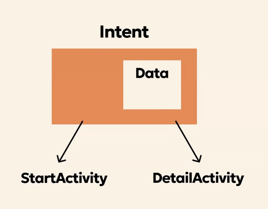

# android_intent

※ 해당 문서의 내용은 안드로이드 공식문서를 참고합니다.   
(https://developer.android.com/guide/components/intents-filters?hl=ko#Receiving)

목차
> 인텐트 유형   
> 인텐트 빌드   
> 암시적 인텐트 수신
> adb 명령어를 활용한 테스트

<br>

위 목차를 알아보기전에 먼저 인텐트에 대해 간단히 알아보겠다.   

Intent는 다른 앱 구성요소에 작업을 요청하는 데 사용할 수 있는 메시지 객체이고, 인텐트는 여러 방식으로 구성요소 간 통신을 지원한다.   

3가지 기본 이용 사례
* 활동 시작
    * Activity 시작: startActivity()로 다른 화면을 실행하고, Intent를 통해 필요한 데이터를 전달한다.
    * Service 시작: startService()로 백그라운드 작업을 수행하거나, bindService()로 다른 구성요소에서 바인딩할 수 있다.
    * Broadcast 전송: sendBroadcast()로 시스템 또는 앱 간 메시지를 전달하며, 수신 측은 BroadcastReceiver를 통해 이벤트를 처리한다.

<br>

### 1. 인텐트 유형
명시적 인텐트
* 전체 ComponentName를 지정하여 인텐트를 충족할 애플리케이션의 구성요소를 지정한다.
* 시작하려는 Activiry, Service의 클래스 이름을 알고 있으므로 일반적으로 명시적 인텐트를 사용하여 자체 앱의 구성요소를 시작한다.
* Context 객체와 Class 객체를 사용해서 생성하는 인텐트는 명시적 인텐트이다.
* 앱 내부에 있는 Activty를 실행하기 위해서 사용된다.

<br>

암시적 인텐트
* 특정 구성요소의 이름을 지정하지 않고 대신 실행할 일반 작업을 선언하므로 다른 앱의 구성요소가 이를 처리할 수 있다.
* 주로 외부앱을 실행시킬때 사용된다.(클래스명을 알 수 없는)

<br><br>

   

1. Activity A가 수행할 작업 정보를 담은 Intent를 생성해서 startActivity()로 시스템에 전달한다.

2. Android 시스템은 이 Intent의 내용과 기기에 설치된 모든 앱의 매니페스트에 선언된 인텐트 필터를 비교해, 어떤 Activity가 이 인텐트를 처리할 수 있는지 탐색한다.

3. 조건과 일치하는 Activity B를 찾으면 Activity B의 onCreate()를 호출하면서 Intent를 함께 전달해 화면을 생성한다.

4. 만약 조건에 맞는 인텐트 필터가 여러 개면, 시스템이 사용자에게 앱 선택 다이얼로그를 띄워 어떤 앱으로 열지 고르게 한다.

5. 어떤 Activity가 어떤 인텐트를 받을 수 있는지는 매니페스트에 선언한 인텐트 필터로 정의되며, 인텐트 필터가 없으면 명시적 인텐트로만 그 Activity를 시작할 수 있다.

<br><br><br>

### 2. 인텐트 빌드
**Component Name(명시적 인텐트 전용)**
* 특정 구성요소(클래스)를 정확히 지정하는 정보이다.
* 사용목적 : 같은 앱 내 Activity, Service 등 정확한 타켓을 지정할 때(명시적)
* 특징 : 안드로이드 시스템이 검색 없이 바로 해당 고성요소를 실행한다.

```kotlin
val intent = Intent(this, TargetActivity::class.java)
// 또는
val component = ComponentName("com.example", "com.example.TargetActivity")
val intent = Intent().setComponent(component)
```

<br><br>

**Action (실행할 작업)**
* Intent가 어떤 작업을 수행하라는 지시를 내리는 문자열이다.
* 예시
```xml
Intent.ACTION_VIEW : 데이터를 보여주기 위해 사용
Intent.ACTION_SEND : 데이터를 공유하기 위해 사용
Intent.ACTION_MAIN : 앱의 진입점을 정의
Intent.ACTION_EDIT : 사용자에 의해 수정될 데이터를 표시
```
* 중요 : 암시적 Intent의 핵심. 인텐트 필터에서 ``` <action>```으로 매칭된다.

<br><br>

**Data (작업 대상 / 어떤 데이터를 처리할지 구분)**
* Action이 적용될 대상 URI와 MIME 타입이다.
* 예시
```xml
android:scheme : URI의 스킴(http, https, file 등등..)
android:host : URI의 호스트 이름
android:port : URI의 포트 번호
android:path : URI의 특정 부분
android:mimeType : MIME 타입(특정 타입)을 지정(image/png, video/* 등등..)
```

<br><br>

**Category (추가 카테고리)**
* Action을 보완하는 부가 정보이다.(작업을 필터링하거나 구분)
* 예시
```xml
intent.category.DEFAULT : 가장 일반적으로 사용되는 카테고리
intent.category.BROWSABLE : 웹 링크를 클릭할 때 링크를 처리
intent.category.HOME : 홈 화면 애플리케이션 식별
intent.category.LAUNCHER : 앱의 아이콘이 앱 런처에 표시
```

<br><br>

**Extra Data(컴포넌트 실행을 요청할 때 데이터를 함께 전달)**   



* 키-값 쌍으로 Intent에 부가 데이터를 실어 전달한다.
* data 전달 : ```putExtra```
* data 수진 : ```getExtra```
* 사용가능한 데이터 타입
    * 기본 데이터 타입
    * 복합 데이터 타입
    * 객체 및 커스텀 데이터 타입
    * 배열, 리스트, 컬렉션 타입


<br><br>

**명시적 인텐트 예시(샘플 프로젝트)**
* 개념 : 이 앱의 이클래스 정확히 실해줘라고 구체적인 클래스명을 직접 지정하는 방식이다.
    * 같은 앱 내부에서 화면 이동이나 서비스 샐행할 때 주로 사용한다.
* 핵심 특징
    * 타겟 확실: Android 시스템이 "어떤 앱을 실행할지" 고민할 필요 없음
    * 보안 안전: 외부 앱이 절대 끼어들 수 없음
    * 실행 빠름: 검색 과정 없이 바로 실행
    * 데이터 전달 쉬움: putExtra로 자유롭게 데이터 전달 가능(위 Extra Data부분)

<br><br>

**암시적 인텐트 예시(샘플 프로젝트)**
* 이런 작업 좀 해줄 앱 찾아줘라고 작업 내용만 정의하고 시스템에 맡기는 방식이다.
    * Action(무엇), Data(대상), Type(MIME)으로 작업을 기술하고 시스템이 적합한 앱을 찾아준다.
* 핵심 특징
    * 시스템 의존: Android 시스템이 모든 앱의 매니페스트 검사해서 매칭
    * 유연함: 여러 앱이 지원 가능 → 사용자 선택
    * 보안 위험: 악성 앱이 인텐트 필터 등록하면 위험
    * 실행 느림: 시스템이 앱 검색하는 시간 필요

<br><br>

**앱 선택기 강제 적용 (createChooser)**
* 왜 필요한데?
* 암시적 Intent로 여러 앱이 지원할 때 ...
```text
시나리오 1: 웹페이지 열기 → Chrome, Samsung Internet, Edge 등 ...
시나리오 2: 텍스트 공유 → 카톡, 메신저, 트위터, 인스타 등 ...

문제: 사용자가 한 번 선택하면 기본 앱으로 자동 설정됨

"항상 Chrome으로 열기" 체크 → 다음부터 선택기 안 뜸
→ 사용자가 원하는 앱을 매번 못 씀

해결: createChooser() 강제 표시

"매번 앱 선택하게 하기" → 체크박스 제거
```
* 상황에 맞게 사용하면 된다.

<br><br>

**안전하지 않은 Intent 실행 감지(Android 12+)**
* Android에서는 Intent 안에 또 다른 Intent가 들어있는 경우(Nested Intent) 이를 검증 없이 실행하면 보안 문제가 발생할 수 있다.
* Android 12(API 31)부터는 StrictMode를 통해 이러한 위험한 Intent 실행을 감지할 수 있다.
```text
1. 앱 A → 앱 B로 Intent 전달
2. 앱 B → extras에서 Intent 추출
3. 앱 B → 해당 Intent 실행

이때 Intent를 검증하지 않고 실행하면 보안 문제가 발생할 수 있다.

외부 앱 → 앱 B → 앱 A 내부 Activity 실행

처럼 exported=false로 보호된 내부 컴포넌트가 우회 실행될 수 있다.


Android 12(API 31)부터는 StrictMode로 위험한 Intent 실행을 감지할 수 있다.
detectAll()을 사용하면 해당 검사도 포함된다.
```

<br><br>

**더 안전한 Intent 사용 권장사항**
* 필요한 Extras만 복사
    * Intent를 그대로 putExtra()로 전달하면 불필요하거나 위험한 데이터까지 같이 전달될 수 있다. 따라서 필요한 값만 선택적으로 복사하는 방식이 안전하다.(전체복 안됨)

    ```kotlin
    val safeIntent = Intent(originalIntent).apply {
        putExtra("title", originalIntent.getStringExtra("title"))
        putExtra("id", originalIntent.getIntExtra("id", 0))
    }
    ```
    <br>
* 내부 구성요소는 ```exported=flase``` 설정
    * 외부에서 접근할 필요가 없는 Activity는 ```exported=flase``` 설정하여 다른 앱에서 실행하지 못하도록 한다.

    ```xml
    <activity
        android:name=".InternalActivity"
        android:exported="false"/>
    ```
    <br>
* Nested Intent 대신 PendingIntent를 사용

       

    ```text
    앱 A → 앱 B에 PendingIntent 전달
    앱 B → PendingIntent.send()
    앱 A의 컴포넌트 안전하게 실행
    ```
    * PendingIntent는 다른 앱이 내 앱의 권한으로 Intent를 실행하도록 허용하는 보안 토큰이다.(호출 권한이 앱에 묶인다.)

<br><br><br>

### 3. 암시적 인텐트 수신
* 나의 앱이 이런 Intent를 처리할 수 있다고 매니페스트에 광고하는 느낌이다.
* 인텐트 매칭 3단계
    ```text
    1️. Action: Intent.action이 필터의 <action>과 정확히 일치
    2️. Category: Intent의 모든 category가 필터에 포함 (필터에 더 많아도 OK)
    3️. Data: URI(scheme+host+port+path) + MIME 타입 일치
    ```
* 예시
    ```xml
    <!-- 앱 런처 -->
    <activity android:name=".MainActivity" android:exported="true">
        <intent-filter>
            <action android:name="android.intent.action.MAIN" />
            <category android:name="android.intent.category.LAUNCHER" />
        </intent-filter>
    </activity>

    <!-- 텍스트 공유 -->
    <activity android:name=".ShareActivity" android:exported="true">
        <intent-filter>
            <action android:name="android.intent.action.SEND"/>
            <category android:name="android.intent.category.DEFAULT"/>
            <data android:mimeType="text/plain"/>
        </intent-filter>
    
        <!-- 멀티미디어 공유 -->
        <intent-filter>
            <action android:name="android.intent.action.SEND"/>
            <action android:name="android.intent.action.SEND_MULTIPLE"/>
            <category android:name="android.intent.category.DEFAULT"/>
            <data android:mimeType="image/*"/>
            <data android:mimeType="video/*"/>
        </intent-filter>
    </activity>

<br><br><br>

### 4. ADB 터미널을 이용한 인텐트 테스트
개발 중 UI 버튼을 일일이 누르지 않고도, 터미널에서 `adb` 명령어를 통해 인텐트의 동작을 직접 검증할 수 있다.
이는 외부 앱이 내 앱을 호출하는 상황을 시뮬레이션하기에 매우 유용하다.

#### 1) 명시적 인텐트 테스트 (특정 화면 바로 열기)
앱의 메인 화면을 거치지 않고 `DetailActivity`를 직접 호출하며 데이터를 전달한다.(exported=true 변경후)
```bash
adb shell 'am start -n com.school_of_company.intent_sample_project/.DetailActivity --es "EXTRA_TITLE" "화면이동 테스트" --ei "EXTRA_ID" 123'
```
* `-n`: 패키지명/클래스명 지정
* `--es`: String 데이터 전달 (Key Value)
* `--ei`: Int 데이터 전달 (Key Value)

<br>


#### 2) 암시적 인텐트 테스트 (공유 수신 확인)
시스템에 공유 인텐트를 날려 내 앱의 `ShareActivity`가 목록에 뜨고 데이터를 잘 받는지 확인한다.(exported=true 변경후)
```bash
adb shell 'am start -a android.intent.action.SEND -t "text/plain" --es "android.intent.extra.TEXT" "텍스트 공유 테스트" com.school_of_company.intent_sample_project'
```
* `-a`: 인텐트 액션 지정
* `-t`: MIME 타입 지정
* 마지막 부분에 패키지명을 추가하면 바로 우리 앱으로 연결됩니다.

<br>


#### 3) 브로드캐스트 리시버 테스트
앱이 백그라운드에 있더라도 커스텀 브로드캐스트를 쏴서 리시버가 작동(Toast 출력)하는지 확인한다.(exported=true 변경후)
```bash
adb shell 'am broadcast -a com.school_of_company.CUSTOM_ACTION --es "EXTRA_MESSAGE" "시그널 테스트"'
```
* `am broadcast`: 브로드캐스트 전송 명령어
* `-a`: 매니페스트에 등록한 커스텀 액션명

<br>

#### 4) 보안 확인 (exported=false)
`exported=false`로 설정된 컴포넌트는 외부 앱이 직접 호출할 수 없다..(exported=true 변경후)
```bash
# 1. AndroidManifest.xml에서 DetailActivity를 다시 exported="false"로 수정
# 2. 아래 명령어를 실행하여 Permission Denial 에러가 발생하는지 확인
adb shell 'am start -n com.school_of_company.intent_sample_project/.DetailActivity'
```